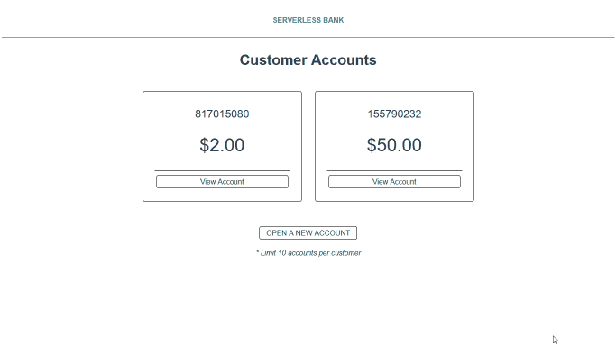

# Getting Started

## API

This project requires Node version 14+.

To deploy to AWS, you must have an AWS account and config/credentials files, which can be set up while installing AWS CLI. You should also install serverless globally.

To deploy, run:

```
npm i
serverless deploy
```

You must deploy to AWS before running locally so that all resources will be created. To run the API locally using serverless-offline:

```
npm run start
```

You must have the API running locally while you run the automated test collection. To run the automated test collection, open another CLI window and run:

```
npm run test
```

Husky uses a pre-push hook to ensure that all automated tests are passing before code can be successfully pushed to a branch. You must have the API running locally in order to push code since pushing code will automatically run the test collection.

To remove the deployed service from the provider (AWS), including all lambdas and DynamoDB table, run:

```
serverless remove
```

## UI

```
npm i -g @vue/cli
```

To run the UI locally, you'll need a .env file in the serverless-bank-ui directory with a variable "VUE_APP_BANK_ENDPOINT". If you are running the API locally, you can set this equal to "http://localhost:3001/"; otherwise, use your deployed endpoint. Then run:

```
cd serverless-bank-ui/
npm i
npm run serve
```

This Vue app is live on Github pages at https://grlucy.github.io/serverless-bank-api/

Updates are published by running:

```
cd serverless-bank-ui
npm run build
git add dist
git commit -m 'add dist subtree'
cd ../
git subtree push --prefix serverless-bank-ui/dist origin gh-pages
```

## Demo



## Technologies Used

- Serverless framework
- serverless-offline plugin
- AWS Lambda
- AWS DynamoDB
- AWS IAM
- Postman
- Newman
- Husky
- Vue 3
- Vue CLI

## Resources

- https://www.serverless.com/framework/docs/getting-started
- https://www.serverless.com/guides/dynamodb
- https://serverless-stack.com/chapters/configure-dynamodb-in-serverless.html
- https://docs.aws.amazon.com/AWSJavaScriptSDK/v3/latest/clients/client-dynamodb/classes/putitemcommand.html
- https://docs.aws.amazon.com/sdk-for-javascript/v3/developer-guide/dynamodb-example-table-read-write.html
- https://techbrij.com/brijpad/#json
- https://youtu.be/FXpIoQ_rT_c
- https://learnvue.co/2020/09/how-to-deploy-your-vue-app-to-github-pages/#tip-handling-vue-router-with-a-custom-404-page
